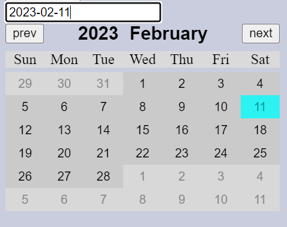
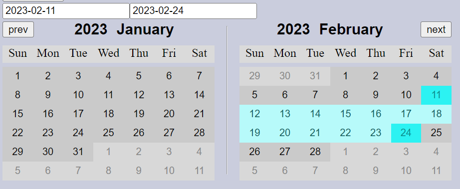
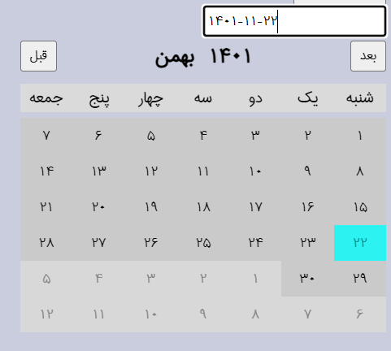

# headless-custom-datepicker

An Headless picker for any js base library/framework that supportig import. you can create your own UI. provide core picker functionality and customizable.

### Table of Contents
- [Futures](#futures)
- [Before start](#before-start)
- [Installation](#installation)
- [Documentation](#documentation)
  - [Definition](#definition)
  - [Types](#types)
  - [Customization](#customization)
    - [DatePicker args](#datepicker-args)
    - [DatePicker return object](#datepicker-return-object)
    - [Utils helpers](#utils-helpers)
    - [Localization](#localization)
    - [Range Picker](#range-picker)
- [Limitatin](#limitatin)
- [Important Notes](#important-notes)
- [Codes Samples](#code-sample)


<hr />
<p float='left'>
  
  
  
</p>
<hr />

## Futures:
+ Easy setup and config
+ Headless UI
+ Easy localization
+ RangePicker and DatePicker 
+ Event base Picker
+ Working with all js base library/framework supporting import (eg, js (with asset bundler), react, react native, angular , ...)
+ Can add holidays, events, badge with no headache
+ Fast and easy to use
+ support leap year
+ No other third party library
+ Very low bundle size
+ Written in typescript

## Before start
+ This package builds on js new Date() so all the dates are based on gregorian calendars
+ Some helpers provide to return formatted dates based on dateFormatter, you can access gregorian time by helpers that assign to it and customize it based on your need. However, it's not recommended.


## Installation
```bash
npm i headless-custom-datepicker

# or using Yarn:
yarn add headless-custom-datepicker
```

## Documentation

### Definition
renderedDate -> used to calculate date for showing days \
selectedDate -> the date selected by user \

### Types
```ts
DateFormat: 'YYYY-MM-DD'
MonthListObject: {name: string, numberOfDays: number, monthNumber: number }
DatePickerMonthState: 'current' | 'next'
LocaleProps: { months: { [0 - 12]: {name: string, numberOfDays: number } }}
-------------------------------------------------
DatePickerType = 'datePicker' | 'rangePicker'
DaysStateTypes = 'prev' | 'next' | 'current'
Days {  day: number,  state: DaysStateTypes,  date: DateFormat }
Mode = 'day' | 'month' | 'year'
```


### Customization

#### DatePicker property

`twoSide?: boolean - default: false` \
enable or disable twoSide picker

`locale: (year: number) => LocaleProps *required` \
provide a way to customize locale based on your region 
- name and numberOfDays are required
- the name used to be shown at the top of the picker

* why is it a function? to support leap year year on some calendars like Jalali

`dateFormatter?: (date: DateFormat) => date` \
used to convert dates for localization.
this function gets an ISO date ('YYYY-MM-DD') and returns the localized base date in the same format.

`weekOffset?: number - default: 0` \
used to add offset to weeks, in gregorian weeks start on sunday but if your week start form another day you most fix it with this property (see localization section)

`dayRenderType?: 'space' | 'fill' - default: 'space'` \
tell the picker how to calculate days
if the first day of month starts in middle of week, this property tells datepicker how to calculate date
- space => count index, later you fill it with empty cell
- fill => fill day array with prev and next month days

`datePickerAutoRow?: boolean - default:false` \
Whether or not the rendered days is in middle

`datePickerMaxRow?: number - default: 6` \
set how many rows datepicker to rendered \
6 shows all rows completely with one or two extra row base if dayRenderType = 'fill' <br /><br />
** recommend not to change it. but the acceptable tested row <= 12, more row cause problem so be carefull.

`delayTimeout?: number - default: 150` \
create 150 ms timeout to change the calendar state for better UX on selecting next or perv month directly when dayRenderType = 'fill' \
** can be disabled by set it to 0

`normalized?: boolean - default: true` \
this determine how to two side date picker behave \
if this is true the odd months start at first and the next month comes after and monthStep default value = 2 and month navigation jumps every 2 months \
if false the render month comes first and the next after monthStep is set to 1 <br /><br />
** Highly recommended this flag set to true if type is rangePicker

`type?: 'datePicker' | 'rangePicker' - default: 'datePicker'`\
set type of datePicker
	
`date?: DateFormat` \
this used to show selected date
	
`endDate?: DateFormat`\
only set for reangePicker if you want to highlight a default range 

#### DatePicker return object
`onChangeDate: (newDate: DateFormat) => void` \
the event triggered on change event and use to update picker

`open: boolean` \
whether or not the calendar is open

`setOpen: (open: boolean) => void` \
use to open/close picker

`mode: 'day' | 'month' | 'year' - default: year` \
based on the mode you create your own UI for displaying the day, month, year, \
month, year helping users to navigate easily between dates

`setMode: (mode) => void` \
use to change mode, if the user clicked on the year you can change the mode and show a list of years

`getDate: () => date: DateFormat` \
return formatted date

`isSelectedDate: (date) => boolean` \
determine given date is selected or not, mainly used for styling

`changeDay: (date) => void` \
use to change date, (handler given to day)

`getRenderedMonthName: () => string` \
return month name, use for title

`getRenderedYear: () => number` \
return rendered year

`handleShowNextMonth: () => void` \
handler use to show next month, use for month navigation

`handleShowPrevMonth: () => void` \
handler use to show previous month, use for month navigation
	
`getMonthList: () => MonthListObject[]` \
return list of month
	
`changeMonth: (monthNumber: number) => void` \
use to change month
	
`getYearsList: (minimumYear: number, maximumYear: number) => numer[]` \
return list of years based on givin minimumYear, maximumYear
	
`changeYear: (year) => void` \
use to change year
	
`getRenderedMonth: () => number` \
use to get rendered month number
	
`isLoading: boolean` \
determine whether or not picker state is loading

`goToToday: ()=>  void` \
go to today	

`getDaysArray: (monthSate?: DatePickerMonthState) => Days[] - default: monthSate = 'current'` \
use to get list of days

`getRenderedNextMonthName: () => string` \
return next month name, use for title, use to render two side date picker

`getRenderedNextDateYear: () => number` \
return next rendered date year

`onCellHover: (date: DateFormat) => void` \
called on date picker cell hover
** Only works on range picker

`getEndDate: () => string` \
return selected end date

`isDateInRange: (date: DateFormat, includeStart: boolean = false, includeEnd: boolean = true) => boolean` \
return true if the given date is in range, this used for styling range picker

`isSelecting: () => boolean` \
return true if the state of date picker is `selecting`, range picker helper

`isEndDate: (date: DateFormat) => boolean` \
return true if the given date is equal to the end date selected in the range picker

`getDayMonthOffset: (index: 0 | 1) => number` \
this function get month days offset when dayRenderType is 'fill', else return 0

<hr />

`handleShowNextYear: () => void` \
handler use to show next year, use for year navigation

`handleShowPrevYear: () => void` \
handler use to show previous year, use for year navigation

`getRenderedDateUnformated: () => string` \
return unformatted rendered date

`getSelecteDateUnformated: () => string` \
return unformatted selected date

`getSelecteEndDateUnformated: () => string | undefined` \
return unformatted selected end date or undefined

`getSelectedEndDate: () => string | undefined` \
return formatted selected end date or undefined

`getRenderedNextMonth: () => number` \
return next month number

`isStartDate: (date: DateFormat) => boolean` \
return if given date is equal to start date (selected date)

`setDate: (date: DateFormat) => void` \
set selected date directly.

`setEndDate: (date: DateFormat) => void` \
set selected end date directly.

`setRenderedDate: (date: DateFormat) => void` \
set rendered date directly.


<hr />

`getMode: () => Mode` \
return picker mode

`isOpen: () => boolean` \
return picker open state

`isLoadingState: () => void` \
return picker loading state


#### Utils helpers
`isValidDateFormat: (date: string) => boolean` \
check if date is valid date `DateFormat`

`addZero: (number: number) => string`\
adding zero for number less than 10

`createDate: (date?: string) => Date` \
crete date including timezone

`validateDate: (date: string) => void` \
if date is invalid throw error


#### Localization
for localization:
- first change week list array
- then set weekOffset based on the week list array `is Sunday the first day of your week leave it or set it to 0`
- after this create locale function
- the last step is to provide a function to translate gregorian date to your locale date `the return date format must be YYYY-MM-DD`
- job is done, test it!

example: jalali localization

- step 1:
```tsx
const weeksTitle = [
  "شنبه", // sat
  "یک", // sun
  "دو", // mon
  "سه", // tue
  "چهار", // wed
  "پنج", // thu
  "جمعه", // fri
]
```

- step 2: \
in jalali first day of week is Saturday so need to set weekOfset to 1

```tsx
...
weekOfset: 1,
...

```

- step 3:

```tsx
const faLocale: DatePickerLocale = (year) => ({ // return month name and numberOfDays in jalali calendar
  months: {
    1: { name: "فروردین", numberOfDays: 31 }, // first month and numberOfDays
    2: { name: "اردیبهشت", numberOfDays: 31 },
    3: { name: "خرداد", numberOfDays: 31 },
    4: { name: "تیر", numberOfDays: 31 },
    5: { name: "مرداد", numberOfDays: 31 },
    6: { name: "شهریور", numberOfDays: 31 },
    7: { name: "مهر", numberOfDays: 30 },
    8: { name: "آبان", numberOfDays: 30 },
    9: { name: "آذر", numberOfDays: 30 },
    10: { name: "دی", numberOfDays: 30 },
    11: { name: "بهمن", numberOfDays: 30 },
    12: { name: "اسفند", numberOfDays: year % 4 === 3 ? 30 : 29 }, // this for leap year
  },
})
```

- step 4:
I use `react-intl` for localization and multi-language but if you don't need multi-language or you don't want to use react-intl you can use any formatter you want just remember follow the dateFormatter signature.

```tsx
import { useIntl } from "react-intl"
import {
  addZero,
} from "headless-custom-datepicker"

...

function toEnglishNumber(str: string) { // you can move this function to utils folder
  const farsiDigits = [/۰/g, /۱/g, /۲/g, /۳/g, /۴/g, /۵/g, /۶/g, /۷/g, /۸/g, /۹/g,]
  for (let i = 0; i < 10; i++) {
    str = str.replace(farsiDigits[i], i.toString())
  }
  return str
}

...

  const { formatDate } = useIntl()

  ...

  const formatter = (date: string) => { // date format is 'YYYY-MM-DD'
    // formatted date using formatDate from react-intl and splited based on '/'
    // react-intl formatDate returns formatted date based on your locale, so all numbers are converted based on
    // your locale but the picker can't understand that (because use new Date() js function)
    // so need to spilt it based on '/' and convert that number to English number
    // then create a date based on 'YYYY-MM-DD'
    
    remember to check return date from this function, because react-intl formatDate return different date format for
    different locale, in this case dd[2] not always return day.

    const dd = formatDate(date).split("/") 

    // convert to en number
    const day = Number(toEnglishNumber(dd[2]))
    const month = Number(toEnglishNumber(dd[1]))
    const year = Number(toEnglishNumber(dd[0]))

    // return 'YYYY-MM-DD' localized date (english number) with 0 for number less than 10
    return `${year}-${addZero(month)}-${addZero(day)}`
  }

  ...
  // add this formatter to DatePicker
  ...
  dateFormatter: formatter,
  ...

```

so the DatePicker looks like this

```tsx
new CustomDatePicker({
  locale: faLocale,
  dateFormatter: formatter,
  weekOffset: 1,
  ...otherConfig
}),
```


- step 5: \
before testing, I need to change body direction to `rtl` and font size. ***(check README in examples folder for more information)*** \
after that, It's done.


#### Range Picker
for using range picker
- set twoSide to true `twoSide: true`
- set type to 'rangePicker' `type: 'rangePicker'`
- in this case, is better to set normalized flag to true `with twoSide flag normalized automatically set to true`


## Limitatin
- be sure Date picker does not create new instances on each render, this is an event-based picker and must be created only once at the start (in React most useMemo for not recreate instance), this mess up with event listener
- this is not a time picker
- only 12-month calendars supported
- your apps must support module system, so you can't use it in the old fashioned javascript app, but you can use it in js app configured with asset bundlers.


## Important Notes
- Although all naming is determined by developer, recommended to used meaningful names. (not too short or long).
- It's very important to make sure picker instances remain the same on each re-render.
- Key binding is not implemented, so if you want you can add your own binding system

## Code Sample
** this code sample is written for React Js. \
** you can see the full samples if example.

`crete datePicker instance`
```tsx

import { CustomDatePicker } from 'headless-custom-datepicker'
import { useState, useEffect, useMemo } from 'react'

function SimpleDatePicker(){
  const [date, setDate] = useState<Date>(new Date())

  const enLocale: DatePickerLocale = (year) => ({
    months: {
      1: { name: "January", numberOfDays: 31 },
      2: { name: "February", numberOfDays: year % 4 === 0 ? 29 : 28 },
      3: { name: "March", numberOfDays: 31 },
      4: { name: "April", numberOfDays: 30 },
      5: { name: "May", numberOfDays: 31 },
      6: { name: "June", numberOfDays: 30 },
      7: { name: "July", numberOfDays: 31 },
      8: { name: "August", numberOfDays: 31 },
      9: { name: "September", numberOfDays: 30 },
      10: { name: "October", numberOfDays: 31 },
      11: { name: "November", numberOfDays: 30 },
      12: { name: "December", numberOfDays: 31 },
    }
  })

  const {
    onChageDate,
    getDaysArray,
    getDayMonthOffset,
    changeDay,
    ...rest
  } = useMemo( // useMemo to insure that only one instance of datePicker exist and remain the same on  re-rendering
    () => new CustomDatePicker({
      date: date.toISOString().slice(0, 10), // convert date to iso format YYYY-MM-DD
      locale: enLocale, 
    }), [])

  // set date on change selected date, use changeDay for on click item
  useEffect(() => {
    onChageDate((newdate) => setDate(newdate))
  }, [])


  // return list of days, you can render this list on your UI
  const daysList = getDaysArray()

  return (
    <div>
    </div>
  )

}
```

if `dayRenderType: space` remember to add this code before rendering daysList, `I use flex-box so each cell get width of 100 / 7`
``` tsx
{Array(getDayMonthOffset()).fill('').map((_, index) => (
  <div
    key={index}
    style={{
      width: `${100 / 7}%`
    }}
  ></div>
))}

```


## LICENSE
[MIT](LICENSE)